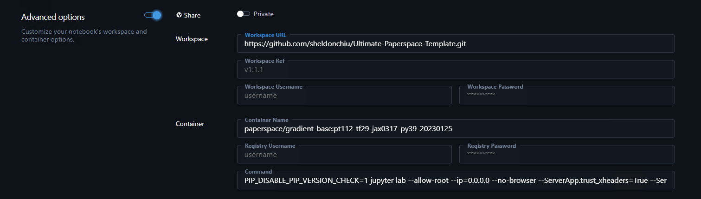

<div align="center">
<h1>Ultimate Paperspace Template</h1>

**A Swiss knife for Paperspace notebooks**

<div align="left">

This repository contains scripts to automatically configure your Paperspace notebook with the following features:

1. Stable diffusion Webui (Feature-rich inference)
2. Stable diffusion Volta (Fast inference)
3. Cloudflare tunnel (Expose your webui to the internet)
4. Sync to Minio Storage
5. More to come...

WEB UI for this repo: https://github.com/sheldonchiu/paperspace-web
## Getting Started
* Paperspace Console -> Create Notebook -> Advanced options -> Workspace -> Workspace URL: **This repository URL**
<div align="center"> 
  
</div>

OR

* Start your own notebook and clone this repository
```bash
git clone https://github.com/sheldonchiu/Ultimate-Paperspace-Template.git
```

## Usage
```bash
export RUN_SCRIPT="<function 1>,<function 1>,..."
bash entry.sh
```

## Configuration
### **Stable diffusion Webui**

**Function name:** sd-webui

**Default Port:** 7860

| ENV | Description | Default |
| --- | --- | --- |
| MODEL_DIR | Directory to store models | /tmp/stable-diffusion-models |
| REPO_DIR | Directory to store WebUI repository | /storage/stable-diffusion |
| MODEL_LIST| comma separated list of models to download |  |
| VAE_LIST | comma separated list of vae models to download |  |
| LORA_LIST | comma separated list of lora models to download |  |
| EMBEDDING_LIST | comma separated list of embedding models to download |  |
| CONTROLNET_LIST | comma separated list of controlnet models to download |  |

**Currnetly support downloading models from Huggingface, Google drive, CivitAI, Magnet Link, normal URL**

### **Stable Diffusion Volta**
    
**Function name:** sd-volta

**Default Port:** 5003
| ENV | Description | Default |
| --- | --- | --- |
| MODEL_DIR | Directory to store models | /tmp/stable-diffusion-models |
| REPO_DIR | Directory to store Volta repository | /storage/stable-diffusion-volta |
| MODEL_LIST| comma separated list of models to download |  |

### **Cloudflare tunnel** 
**Function name:** cloudflared
| ENV | Description | Default |
| --- | --- | --- |
| CF_TOKEN | Cloudflare API token |  |

**If CF_TOKEN = "quick" a free tunnel with a tempeory URL will be created**

**URL will be stored inside /tmp/cloudflared_\<port number\>.host** 

### **Sync to Minio Storage**
    
**Function name:** minio
| ENV | Description | Default |
| --- | --- | --- |
| S3_HOST_URL | Minio URL |  |
| S3_ACCESS_KEY | Minio Access Key |  |
| S3_SECRET_KEY | Minio Secret Key |  |
| S3_MIRROR_PATH | Directory to sync to Minio |  |
| S3_MIRROR_TO_BUCKET | Minio target bucket | |

**If S3_MIRROR_PATH and S3_MIRROR_TO_BUCKET is not given, the script will only setup the Minio client**

## Example
Run Stable diffusion Webui and expose it to the internet using Cloudflare tunnel
```bash
export MODEL_LIST="https://huggingface.co/runwayml/stable-diffusion-v1-5/resolve/main/v1-5-pruned-emaonly.safetensors,https://huggingface.co/stabilityai/stable-diffusion-2-1/resolve/main/v2-1_768-ema-pruned.safetensors"
export RUN_SCRIPT="sd-webui,cloudflared"
export CF_TOKEN="quick"
bash entry.sh
```

## Contributing
If you have an idea for a new feature or have found a bug, please open an issue or submit a pull request.

## Acknowledgements
Stable diffusion Webui setup is based on the following repository:

https://github.com/Engineer-of-Stuff/stable-diffusion-paperspace